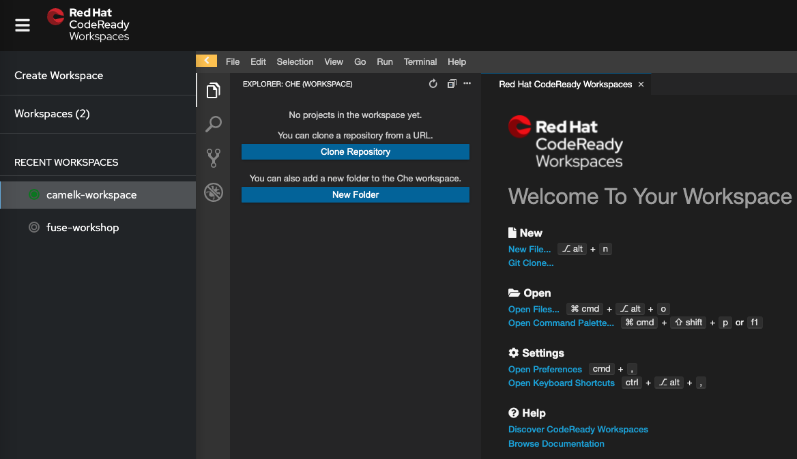
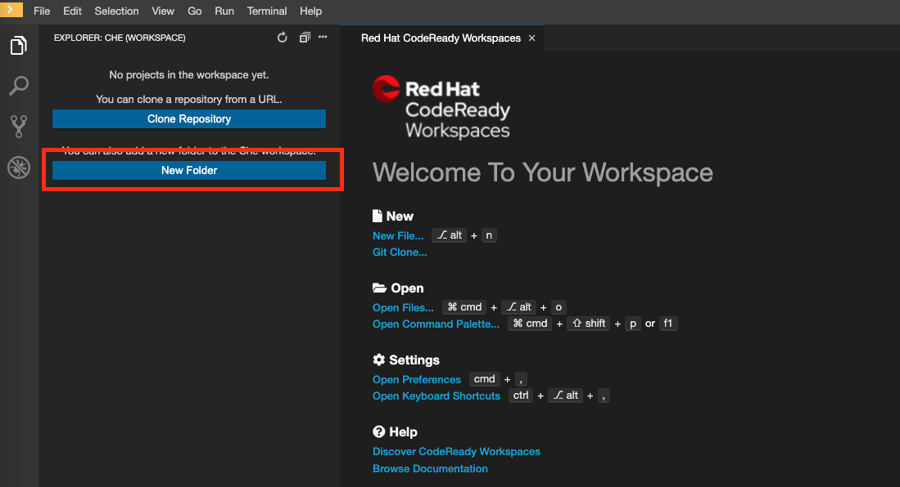
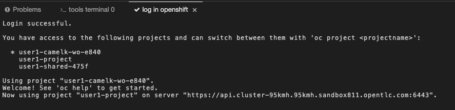
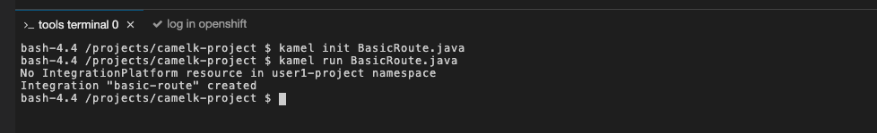
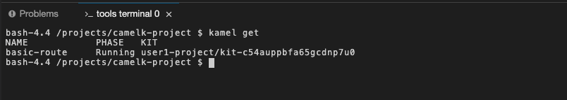
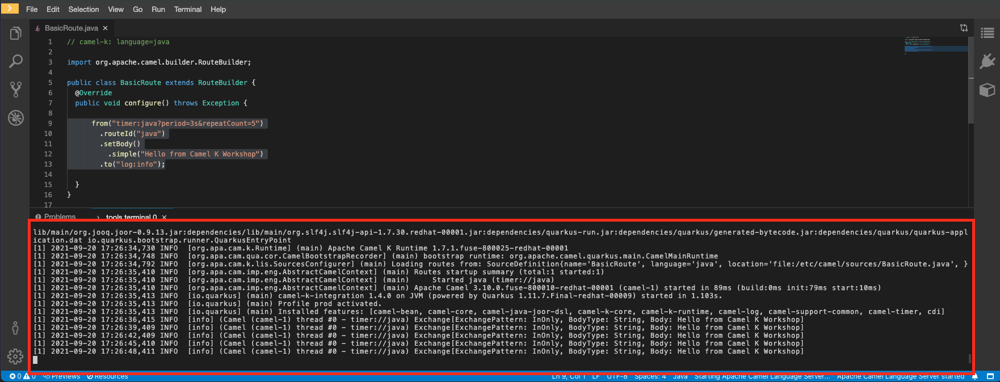

:walkthrough: Basic Camel K Deployment
:codeready-url: {che-url}
:openshift-url: {openshift-host}
:user-password: openshift

= Lab 1 - Camel K Introduction

Introduction to Camel K's basic concepts and how to deploy your first integration.

https://camel.apache.org/camel-k/latest/[Camel K] is a lightweight integration framework built from Apache Camel that runs natively on Kubernetes and is specifically designed for serverless and microservice architectures.

It utilizes an https://kubernetes.io/docs/concepts/extend-kubernetes/operator/[Operator] on the Kubernetes side to automate integrations deployment and management.

The Operator is already installed for you and a development environment is provided with the tools you will need.

[type=walkthroughResource,serviceName=codeready]
.CodeReady Workspaces
****
* link:{codeready-url}[Console, window="_blank"]
* link:https://developers.redhat.com/products/codeready-workspaces/overview/[Want to know more about CodeReady Workspaces?, window="_blank"]
****

[type=walkthroughResource,serviceName=openshift]
.OpenShift Console
****
* link:{openshift-url}[Console, window="_blank"]
****

== Lab Requirements

. Web Browser (Firefox or Chrome)

[time=2]
== Accessing Code Ready Workspace

These walkthroughs use link:https://developers.redhat.com/products/codeready-workspaces/overview[CodeReady Workspaces, window="_blank"] (based on https://www.eclipse.org/che[Eclipse Che]).
It's an IDE on the cloud based on containers. You can also use a local development environment if you'd prefer (i.e. https://code.visualstudio.com[Visual Studio Code], https://developers.redhat.com/products/codeready-studio/overview[Red Hat CodeReady Studio] (formerly known as JBoss Developer Studio), https://www.jetbrains.com/idea[IntelliJ IDEA], etc).

.Open link:{codeready-url}/dashboard/#/ide/{user-username}/camelk-workspace[CodeReady Workspaces, window="_blank"]

{empty} +

This link will open the appropriate workspace for this workshop. If you are not already logged in, the credentials are:

* Username: `{user-username}`
* Password: `{user-password}`

{empty} +

Wait for it to load. After a few seconds, you should see a page like this:

[type=verification]
Were you able to open the workspace?

[time=3]
== Deploying First Camel K Route

=== Initializing the project

As you could see, the workspace starts without a project. So let's create one.

. On the right panel, click *New Folder*.
. Type in the project name, `camelk-project`.

To interact with Camel K Operator, we are going to use the Camel K CLI (kamel). Start with a simple  help command.
On the right side panel, click on *tools -> New terminal*. In the terminal, run:

[source,bash]
----
kamel help
----

*help* shows you any available command and it's options. You may use it later to check more advance options.
For now, we are going to use the CLI to create our first route. In the terminal, under the project folder, run:

[source,bash]
----
kamel init BasicRoute.java
----

The folder and the newly created file will be visible in the *explorer tab*. Take a look at how the Java file looks like:

image::images/03_new-class.png[New Class, role="integr8ly-img-responsive"]

{empty} +

It's a `Camel Route` just like you learned in the `Fuse Workshop`.

[type=verification]
Were you able to open the generated code?

=== Language support

Camel K supports multiple languages for writing integrations:

. Java
. YAML
. XML
. Groovy (Experimental)
. Kotlin (Experimental)
. JShell (Experimental)
. JavaScript (Experimental)

For this workshop we will continue to use *Java* language.

[time=3]
== Running the integration

As others Kubernetes CLI, kamel will interact with the cluster in use by the current user. So, to start using kamel, we need to be logged in OpenShift.

On the left panel, click on *log in openshift*. A message like this will be displayed in the lower tab:

Once you are logged, on the opened terminal, run the following command to deploy and run the integration:

[source,bash]
----
kamel run BasicRoute.java
----

If everything went as expected, you should see:

Based on the declared route, the Camel K Operator will create a Quarkus deployment for you. You don't need to declare dependencies.
Camel K analyzes your code and identifies what types of Camel components are you using.

Since it is the first time you are running an integration, Camel K will create a *kit* for this route. A kit is basically a container where the image will be built.

You can also use kamel to inspect the integrations present in your project. Like this:

[source,bash]
----
kamel get
----

after the building phase, you should see a return like this:

You can also check the application logs by running:

[source,bash]
----
kamel logs basic-route
----

[type=verification]
Were you able to see the route running?

[time=3]
== Updating the integration

Let's do some modifications to the code and deploy our changes. Replace the route in the `BasicRoute.java` with this:

[source, java]
----
from("timer:java?period=3s&repeatCount=5")
  .routeId("java")
  .setBody()
    .simple("Hello from Camel K Workshop")
  .to("log:info");
----

to update the route, first, let's remove it.

[source, bash]
----
kamel delete basic-route
----

then run it again.

[source, bash]
----
kamel run BasicRoute.java
----

Check the logs again. They should look like this:

[type=verification]
Were you able to update your integration?

[time=1]
== Summary

In this module you learned what Camel K is, some basic commands using the *kamel* CLI and how to deploy your first integration.

Congratulations, you finished your first example with *Camel K*!
