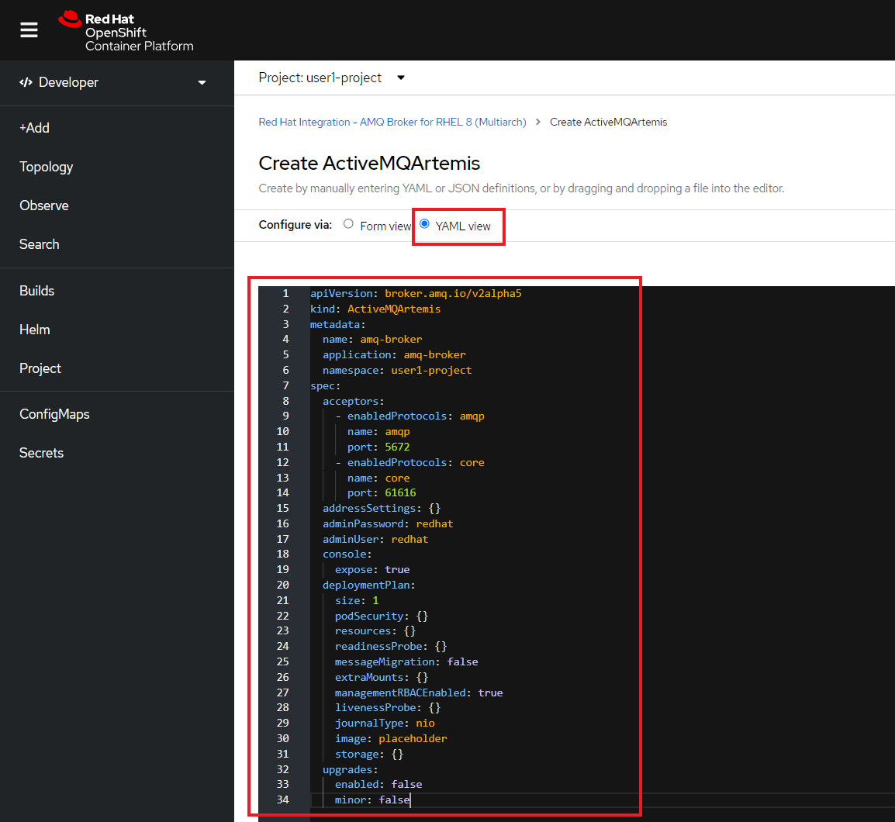
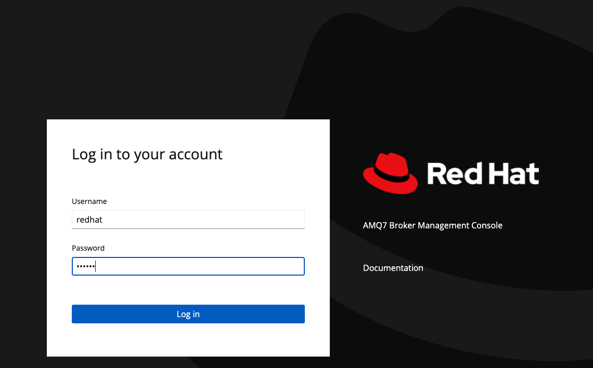

:walkthrough: Messaging and Config Files
:codeready-url: {che-url}
:openshift-url: {openshift-host}
:user-password: openshift

= Lab 2 - Messaging and Config Files

Connect to a message broker and use configmaps to change the integration configuration.

In the first lab you learned what is and how to use Camel K. Now is time to see other possibilities when writing integrations using it.

A very common good practice is to separate application logic from application configuration. In this lab you will learn how to use https://kubernetes.io/docs/concepts/configuration/configmap/[Configmaps] to configure your integration.
As an example we are going to connect to https://access.redhat.com/products/red-hat-amq/[Red Hat AMQ Broker] using the https://www.amqp.org/[AMQP] protocol.

[type=walkthroughResource,serviceName=codeready]
.CodeReady Workspaces
****
* link:{codeready-url}[Console, window="_blank"]
* link:https://developers.redhat.com/products/codeready-workspaces/overview/[Want to know more about CodeReady Workspaces?, window="_blank"]
****

[type=walkthroughResource,serviceName=openshift]
.OpenShift Console
****
* link:{openshift-url}[Console, window="_blank"]
****

== Installing AMQ Broker 

Let's provision an AMQ Broker on this step. On the *Developer* view, click on *Add* on the left side menu.
Select *Operator Backed* option. Filter by *AMQ Broker* and select the *AMQ Broker* tile.

image::./images/07.png[]

{empty} +
Click on *Create*.

image::./images/08.png[]

On the configuration select *Yaml view*  and paste the following content:

[source,yaml,subs="attributes+", id="amq-cr"]
----
apiVersion: broker.amq.io/v2alpha5
kind: ActiveMQArtemis
metadata:
  name: amq-broker
  application: amq-broker
  namespace: {user-username}-project
spec:
  acceptors:
    - enabledProtocols: amqp
      name: amqp
      port: 5672
    - enabledProtocols: core
      name: core
      port: 61616
  addressSettings: {}
  adminPassword: redhat
  adminUser: redhat
  console:
    expose: true
  deploymentPlan:
    size: 1
    podSecurity: {}
    resources: {}
    readinessProbe: {}
    messageMigration: false
    extraMounts: {}
    managementRBACEnabled: true
    livenessProbe: {}
    journalType: nio
    image: placeholder
    storage: {}
  upgrades:
    enabled: false
    minor: false
----

{empty} +

If everything worked fine, you should see a new pod in the *topology* view.

Now, let's open the Management Console of the AMQ Broker. On the left panel, click *Search*. On the resources dropbox, select `Route`.

image::./images/11.png[]

{empty} +

Click on the Route URL.

{empty} +
Click on *Management Console*.

image::./images/13.png[]

Enter the following credentials:

* Username: `redhat`
* Password: `redhat`

{empty} +
This is AMQ Console main page. Click on the Queues tab.

image::./images/15.png[]

{empty} +
You may use this page to monitor the queues statistics.

image::./images/16.png[]

{empty} +

[type=verification]
Were you able to deploy AMQ?

[time=4]
== Setting up the Queue

For this lab we are going to need a new queue. In the `{user-username}-project` namespace, using the *Developer view*, go *+Add -> Operator Backed -> AMQ Broker Address*.

Set the *Name*, *Address name* and *Queue name* as `camelk`.

image::images/01_address.png[Creating address, role="integr8ly-img-responsive"]

You should be able to visualize the address/queue in the AMQ web console.

[type=verification]
Did you provision the queue?

[time=4]
== Coding the integration

Let's create the file for our integration. On the explore panel, right-click on the `camelk-project` folder and add a new file.

Name it `AmqpRoute.java`. Paste the following code as it's content:

[source, java]
----
// camel-k: language=java

import org.apache.camel.builder.RouteBuilder;

public class AmqpRoute extends RouteBuilder {
  @Override
  public void configure() throws Exception {

      from("amqp:queue:{{queue.name}}")
        .routeId("amqp-route")
        .log(" here is the body : ${body}");

  }
}
----

We are using the Camel syntax, `{{ property-key }}`, to access a property value and modify how we are declaring the route.
This is very useful because with a single route declaration, we may be able to configure this integration to work in different environments.

To be able to access a message broker, we need information like the broker URL, user and password.
When using Quarkus we don't usually set these in the code, but in the `application.properties` file.
Since we are not packing a jar here, things work in different way.

Kubernetes allow us to separate application binaries and configuration files, by using `Secrets` and `Configmaps`, and that is exactly what we are going to use, a Configmap to be used as the application properties.

Let's create a new file named `cm.yaml`. Here is the file content:

[source, yaml]
----
apiVersion: v1
kind: ConfigMap
metadata:
  name: amqp-route-cm
data:
  quarkus.qpid-jms.url: amqp://amq-broker-ss-0.amq-broker-hdls-svc:5672
  quarkus.qpid-jms.username: redhat
  quarkus.qpid-jms.password: redhat
  queue.name: camelk
----

Now we have all the required information to access the broker.

[type=verification]
Did you create the file?

[time=10]
== Running and testing

Now that you have the files, is time to deploy the integration.

In case you are not, Log in OpenShift using the right panel command.

On the right panel, under tools, click on `New terminal`.

Start by creating the *Configmap* in your namespace:

[source, bash]
----
oc apply -f cm.yaml
----

Run the integration mapping the configmap created to your route:

[source, bash]
----
kamel run AmqpRoute.java --configmap amqp-route-cm
----

Wait for the kit build to finish and then start monitoring the integration logs:

[source, bash]
----
kamel logs amqp-route
----

leave the command running, we will need it later.

image::images/03_logs.png[Logs, role="integr8ly-img-responsive"]

[type=verification]
Are your integration running?

Let's use AMQ's web console to send messages to our queue. Open it using the amq-broker route.

In case you forgot the credentials:

* Username: `redhat`
* Password: `redhat`

With the console open, in the folder structure, select the *camelk* queue. This will enable the *Send message* tab. Click on it.

image::images/04_send-tab.png[Send message tab, role="integr8ly-img-responsive"]

You may enter the following content for your test messag:

[source, json]
----
{"message": "Testing Camel K"}
----

Paste the message and click on *Send message* button.

image::images/05_send.png[Send message, role="integr8ly-img-responsive"]

Go back to Codeready Workspace. The message you sent should be displayed in the logs:

image::images/06_log-return.png[Send message, role="integr8ly-img-responsive"]

[type=verification]
Are you able to visualize the message?

[time=1]
== Summary

In this lab you learned how to separate your integration code and the code configuration using ConfigMap. You also saw how to connect to the AMQ Broker using the AMQP component.

Congratulations on finishing another lab about Camel K!
