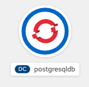
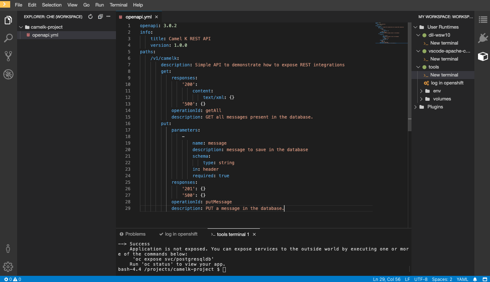
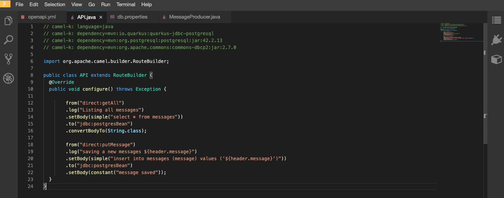
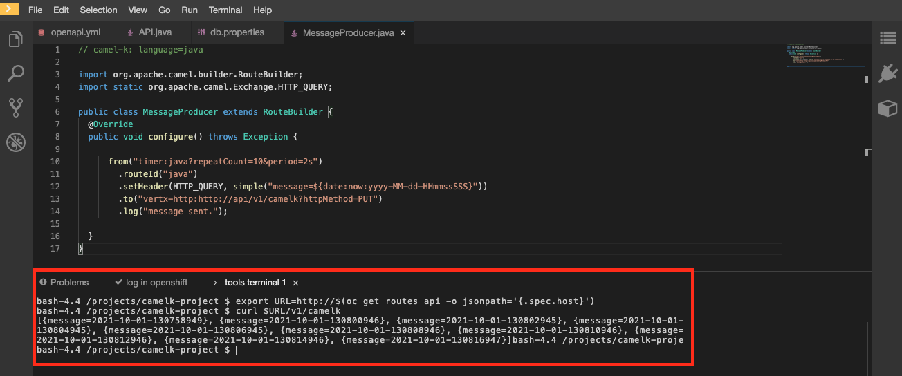

:walkthrough: REST API and Databases
:codeready-url: {che-url}
:openshift-url: {openshift-host}
:user-password: openshift

= Lab 3 - REST API and Databases

Expose a REST API using an OPEN API document definition and persist state by accessing a PostgreSQL database.

REST API is currently the most common way to implement synchronous communication with a high level interface definition. In this lab you will learn how to expose REST endpoints using Camel K,
and also how to access access database with the stack.

[type=walkthroughResource,serviceName=codeready]
.CodeReady Workspaces
****
* link:{codeready-url}[Console, window="_blank"]
* link:https://developers.redhat.com/products/codeready-workspaces/overview/[Want to know more about CodeReady Workspaces?, window="_blank"]
****

[type=walkthroughResource,serviceName=openshift]
.OpenShift Console
****
* link:{openshift-url}[Console, window="_blank"]
****

[time=4]
== Setting up the environment

For this lab we will be using the same project folder, `camelk-project`, of labs 1 and 2. The only thing we need to add is a PostgreSQL database instance.
Instead of using the web console, let's do this using the `oc` CLI, it will make thins easier.

. In case you don't have, log in OpenShift using *tools -> log in openshift*
. Open an terminal in case you don't have one already, then type:

[source, bash]
----
oc new-app --name postgresqldb -e POSTGRESQL_USER=redhat -e POSTGRESQL_PASSWORD=redhat  -e POSTGRESQL_DATABASE=camelk quay.io/gcamposo/postgresql-camelk:latest
----

Run the command, then look at the link:{codeready-url}[Console, window="_blank"]. It will take a few seconds to download the image and to start the pod.

[type=verification]
Is PostreSQL running?

[time=3]
== Defining the API

During the `Fuse Workshop - Lab 3 REST and Database` you saw how to create a REST service and even how to generate an OAS document from it.
For this Lab we are going to do the top-down approach, where we define the interface first, and from that we do the implementation.

Our use case is a simple application that receive messages and save them in the database, also allowing a search for all messages already persisted.

We could use something like https://www.apicur.io/studio/[Apicurio API Designer] to crate our OAS definition, but to make thins simpler we will provide it to you.

Create a new file named `openapi.yml` and paste the following content in:

[source, yaml]
----
openapi: 3.0.2
info:
    title: Camel K REST API
    version: 1.0.0
paths:
    /v1/camelk:
        description: Simple API to demonstrate how to expose REST integrations
        get:
            responses:
                '200':
                    content:
                        text/xml: {}
                '500': {}
            operationId: getAll
            description: GET all messages present in the database.
        put:
            parameters:
                -
                    name: message
                    description: message to save in the database
                    schema:
                        type: string
                    in: header
                    required: true
            responses:
                '201': {}
                '500': {}
            operationId: putMessage
            description: PUT a message in the database.
----

It should look like this:

This document describes the possible operation calls based on HTTP methods and paths, also describe expected input and output types.
One thing that is not directly tied to HTTP protocol, but it is very important for our implementation, is the `operationId` attribute.
In order to understand what I mean, let's create the route.

[type=verification]
Did you create the openapi.yml file?

[time=3]
== Defining the route

Create a new file called `API.java`, and set the following as it's content:

[source, java]
----
// camel-k: language=java
// camel-k: dependency=mvn:io.quarkus:quarkus-jdbc-postgresql
// camel-k: dependency=mvn:org.postgresql:postgresql:jar:42.2.13
// camel-k: dependency=mvn:org.apache.commons:commons-dbcp2:jar:2.7.0

import org.apache.camel.builder.RouteBuilder;

public class API extends RouteBuilder {
  @Override
  public void configure() throws Exception {

        from("direct:getAll")
        .log("Listing all messages")
        .setBody(simple("select * from messages"))
        .to("jdbc:postgresBean")
        .convertBodyTo(String.class);

        from("direct:putMessage")
        .log("saving a new messages ${header.message}")
        .setBody(simple("insert into messages (message) values ('${header.message}')"))
        .to("jdbc:postgresBean")
        .setBody(constant("message saved"));
  }
}

----

As you can see we are not using the https://camel.apache.org/manual/latest/rest-dsl.html[REST DSL] as we did in the `Fuse Workshop`, instead we are using the https://camel.apache.org/components/latest/direct-component.html[direct] component referencing the *operationId*
in the `openapi.yml` file. This means that Camel k is taking care of declaring the web server/REST configuration we need to create this route.

You should also have noticed the dependencies declaration in the file.

[source, java]
----
// camel-k: dependency=mvn:io.quarkus:quarkus-jdbc-postgresql
// camel-k: dependency=mvn:org.postgresql:postgresql:jar:42.2.13
// camel-k: dependency=mvn:org.apache.commons:commons-dbcp2:jar:2.7.0
----

We had to use it because this route has dependencies that cannot be inferred by analyzing the code, such which jdbc driver it should use.

The RouteBuilder should look like this:

[type=verification]
Did you create the API.java file?

[time=3]
== Running the integration

There is one configuration left to do. Since we are accessing a database we need the database access details. In the route we are using the https://camel.apache.org/components/latest/jdbc-component.html[jdbc] component and pointing that to a bean configuration.
Let's create the bean. Create a new file called `db.properties`. Copy and paste the following content:

[source, text]
----
camel.beans.postgresBean = #class:org.apache.commons.dbcp2.BasicDataSource
camel.beans.postgresBean.url = jdbc:postgresql://postgresqldb:5432/camelk
camel.beans.postgresBean.username = redhat
camel.beans.postgresBean.password = redhat
camel.beans.postgresBean.validation-query = SELECT 1
----

[type=verification]
Did you create the db.properties file?

Now we can use the kamel CLI to run the integration:

[source, bash]
----
kamel run API.java --open-api openapi.yml --property-file db.properties
----

We used `--open-api` to create a route using an OpenAPI definition, and differently from the previous lab, we asked the operator to pack the `db.properties` as the application  `application.properties` using `--property-file`.
The idea was to show there was another possibility to inject configuration into the integration.

Wait for the integration to be ready. You can check that using:

[source, bash]
----
kamel get
----

[type=verification]
Is the integration running?

[time=3]
== Testing the integration

Let's create another integration using the https://camel.apache.org/components/3.11.x/timer-component.html[timer] component to populate the database for us.
We are also going to use the https://camel.apache.org/components/3.11.x/vertx-http-component.html[vertx-http] component to serve as our HTTP Client.

Create a new file called `MessageProducer.java` and past the following code as it's content:

[source, java]
----
// camel-k: language=java

import org.apache.camel.builder.RouteBuilder;
import static org.apache.camel.Exchange.HTTP_QUERY;

public class MessageProducer extends RouteBuilder {
  @Override
  public void configure() throws Exception {

      from("timer:java?repeatCount=10&period=2s")
        .routeId("java")
        .setHeader(HTTP_QUERY, simple("message=${date:now:yyyy-MM-dd-HHmmssSSS}"))
        .to("vertx-http:http://api/v1/camelk?httpMethod=PUT")
        .log("message sent.");

  }
}
----

This route is going to send ten messages to our REST endpoint with a two seconds delay between each call.
Regarding the component configuration, we are using `headers` to dynamically modify the HTTP call, by changing what is sent as HTTP query parameters. The *message* is just the complete date, which is dynamically generated using the https://camel.apache.org/components/3.11.x/languages/simple-language.html[Simple Language].

To deploy the integration, run:

[source, bash]
----
kamel run MessageProducer.java
----

[type=verification]
Is the message-producer running?

Once the `message-producer` starts running, we can use the API to get the messages saved in the database. Open the terminal and run the following command:

[source, bash]
----
export URL=http://$(oc get routes api -o jsonpath='{.spec.host}')
curl $URL/v1/camelk
----

If everything worked as expected, you should see a response like this:

[type=verification]
Did you visualize the response?

[time=1]
== Summary

Congratulations on finishing another lab about Camel K!

In this lab you learned:

. How to expose REST API's
. How to pack in properties
. How to access databases
. How to consume API's
